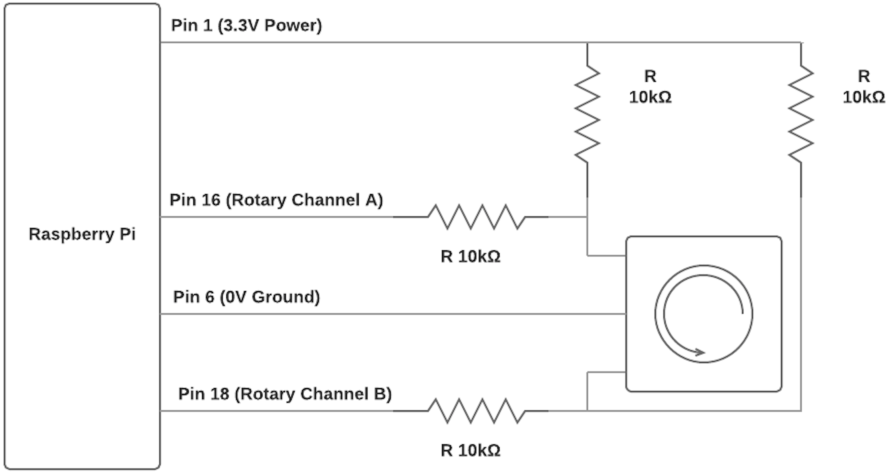

# Volume Dial

## Pre-requisites

The following packages need to be installed:

1. [RPi.GPIO](https://sourceforge.net/p/raspberry-gpio-python/wiki/install/)
1. [pyalsaaudio](https://pypi.org/project/pyalsaaudio/)

## Installation

1. Copy the `volume_dial.py` file to the `/opt/` directory
1. Copy the `volume-dial.service` file to the `/etc/systemd/system/` directory
1. Run the command `sudo systemctl enable volume-dial.service` to enable the volume control service
1. Run the command `sudo systemctl start volume-dial.service` to start the volume control service

## Circuit Diagram

